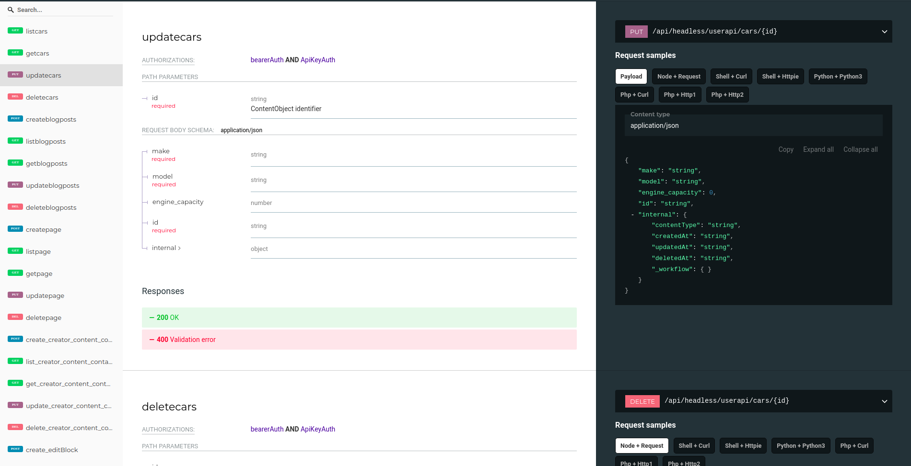

# Enrich your OpenAPI 3.0 schema with examples

Thanks to the wonderful [swagger-snippet](https://github.com/ErikWittern/swagger-snippet) module you can now simply enrich your OpenAPI schema with code samples. It's as easy as 1.2.3.

1. Clone this repo
2. ``npm install``
3. ``node index.js --input=your_oas.json``

## Example Usage
Clone this repo
```
git clone https://github.com/cdwv/oas3-api-snippet-enricher
```
Install NPM packages
```
npm install
```
Enrich your OAS 3.0 Schema!
```
node index.js --input=openapi.json > openapi-with-examples.json
```

Alternatively you can point it to a YAML-formatted spec:
```
curl https://raw.githubusercontent.com/OAI/OpenAPI-Specification/master/examples/v3.0/petstore.yaml --output petstore.yaml
node index.js --input=petstore.yaml > openapi-with-examples.json
```

Use targets options to specific languages:
```
node index.js --targets="node_request,shell_curl" --input=openapi.json >  > openapi-with-examples.json
```

Use [ReDoc](https://github.com/Redocly/redoc/) to build beautiful API doc:
```
redoc-cli bundle openapi-with-examples.json
```

enjoy.



Contributing
=======================================================================

Contributions are most welcome!


License
=======================================================================

MIT

Maintainers
===========

[](http://codewave.eu)

Project is currently maintained, in our spare time, by [codewave.eu](http://codewave.eu) and a growing number of Contributors!
